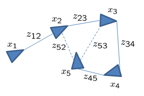

# 运行指令

## 画图运行指令
```sh
python3 plot_result.py --optimized_poses ../data/poses_optimized.txt --initial_poses ../data/poses_original.txt
```


## 优化执行指令

```sh
sudo ./pose_graph_2d --input=/home/hibo/Personal/learn_ceres_ws/ch4_pose_graph/data/input_M3500_g2o.g2o
```


# SLAM 
假设一个机器人在二维平面上运动。该机器人可以使用一组传感器，例如车轮里程计或激光测距扫描仪。我们希望根据这些原始测量值估算机器人的轨迹并构建环境地图。为了降低问题的计算复杂度，位姿图方法将原始测量值抽象出来。具体来说，它创建一个由节点和边组成的图，节点表示机器人的位姿，边表示两个节点之间的相对变换（位置和方向的增量）。这些边是从原始传感器测量值中得出的虚拟测量值，例如，通过积分原始车轮里程计或对齐从机器人获取的激光测距扫描仪。最终图形的可视化效果如下所示。



图中三角形表示机器人的位姿，连接线表示测量值，虚线表示回环测量值。回环测量值是指机器人非连续状态之间的测量值，可以减少误差随时间推移的累积。

在 SLAM（Simultaneous Localization and Mapping）中，**信息矩阵（Information Matrix）** 是图优化中的一个核心概念，用于表达误差约束中的 **不确定性与置信度**。

---

##  1. 信息矩阵 是什么？

信息矩阵通常记作 **Ω（Omega）**，是协方差矩阵 Σ 的 **逆矩阵**：

$$
\Omega = \Sigma^{-1}
$$

在图优化中，一个边（如一个里程计约束或闭环约束）通常用如下误差函数表示：

$$
e(x_i, x_j, z_{ij}) = z_{ij} \ominus (x_i^{-1} \cdot x_j)
$$

其中：

* $x_i, x_j$：两个节点（位姿）
* $z_{ij}$：测量值
* $\ominus$：误差计算
* 误差项的权重就是通过 **信息矩阵 Ω** 施加的：

$$
\text{Cost} = e^\top \Omega e
$$

---

##  2. 信息矩阵的作用

###  1. **衡量置信度 / 权重**

* 信息矩阵元素大 → 说明你“很相信”这个观测/约束；
* 信息矩阵元素小 → 说明这个观测“不太可靠”；
* 信息矩阵为单位阵（identity）→ 所有方向权重一样。

###  2. **影响优化结果**

* 图优化中，各个边通过信息矩阵“拉扯”节点；
* 高信息值的边“拉得更紧”；
* 在回环检测中，闭环约束的权重非常关键。

---

##  3. 信息矩阵在 2D / 3D SLAM 中

| 类型                                  | 信息矩阵维度 | 含义            |
| ----------------------------------- | ------ | ------------- |
| 2D Pose (x, y, θ)                   | 3×3    | 控制平移/旋转方向的置信度 |
| 3D Pose (x, y, z, roll, pitch, yaw) | 6×6    | 平移和旋转的联合置信度   |

---

##  4. 信息矩阵在 g2o / Ceres 中的使用

###  在 `g2o` 中：

```cpp
edge->setInformation(Eigen::Matrix3d::Identity() * weight);
```

###  在 `Ceres` 中：

信息矩阵体现在 **残差函数返回的 residual 与其平方误差** 中。
如果你希望通过信息矩阵加权，可以这样处理：

```cpp
residual = sqrt_info_matrix * (measured - predicted);
```

其中 `sqrt_info_matrix` 是信息矩阵的平方根（可通过 Cholesky 分解求得）。

---

##  5. 示例：2D Pose Graph Edge

```cpp
Eigen::Matrix3d information;
information << 
    100, 0,   0,
    0,   100, 0,
    0,   0,   100;
```

表示对 **x、y、θ** 的测量非常有信心。

---

## 📌 总结一句话：

> **信息矩阵用于表示误差项在优化中应有多大影响 —— 它控制了观测的“话语权”。**

---

这是个非常核心的问题，涉及到优化中的“加权误差”思想。我们来系统解释一下：

---

## ✅ 为什么要引入信息矩阵？

在位姿图优化、SLAM 或任意的非线性最小二乘问题中，我们面对的是**带不确定性的观测**，也就是说：

> 不同观测的“可靠程度”不同。

### 🔧 举个例子：

假设你有两个观测：

* 第一个传感器观测残差是 `1.0`，但它很**不准**；
* 第二个传感器观测残差是 `0.5`，但它很**准**；

如果你**不加权处理**，优化器会认为它们一样重要，但这显然是不合理的。

---

## ✅ 信息矩阵的作用就是给观测残差加“权重”

在经典的误差项写法中：

$$
\text{residual} = \text{prediction} - \text{measurement}
$$

但有了协方差矩阵 $\Sigma$ 后，误差应加权处理为：

$$
\text{cost} = \mathbf{e}^\top \Sigma^{-1} \mathbf{e}
$$

其中：

* $\mathbf{e}$ 是误差向量；
* $\Sigma^{-1}$ 就是所谓的**信息矩阵**，它控制“这个误差对总优化目标的贡献有多大”。

这相当于在说：“越置信的观测，权重越大（协方差越小）”。

---

## ✅ 为什么不直接用协方差？

因为我们需要的是：

* **惩罚不可信的误差少一点**；
* **惩罚可信的误差多一点**。

这恰好对应于协方差的**逆矩阵**，也就是信息矩阵。

而且在高斯分布建模中，我们的误差假设服从：

$$
\mathbf{e} \sim \mathcal{N}(0, \Sigma)
$$

最大似然估计目标函数就是：

$$
\min \mathbf{e}^\top \Sigma^{-1} \mathbf{e}
$$

这就是为什么 Ceres 和 g2o 都是用 **信息矩阵**（协方差的逆）作为残差项的加权因子。

---

## ✅ 进一步：为什么要用 `sqrt_information`？

因为在 Ceres 中你通常写的是残差项 $\mathbf{r}$，然后 Ceres 自动构造平方和：

$$
\text{cost} = \| \sqrt{\text{information}} \cdot \mathbf{r} \|^2
$$

这样优化器就知道如何使用雅可比矩阵进行高效求解，而不需要你手动写整个二次型。

---

## 📌 总结

| 名称                 | 含义                   | 在优化中作用              |
| ------------------ | -------------------- | ------------------- |
| 协方差矩阵 $\Sigma$     | 表示观测的不确定性大小          | 越大表示越不可信            |
| 信息矩阵 $\Sigma^{-1}$ | 观测的不确定性反比量（权重）       | 权重越大，误差越被“重视”       |
| `sqrt_information` | 信息矩阵的平方根矩阵（Cholesky） | 便于残差乘权重，适配 Ceres 接口 |

---
对信息矩阵做 Cholesky 分解，取下三角矩阵 L，即 sqrt_information