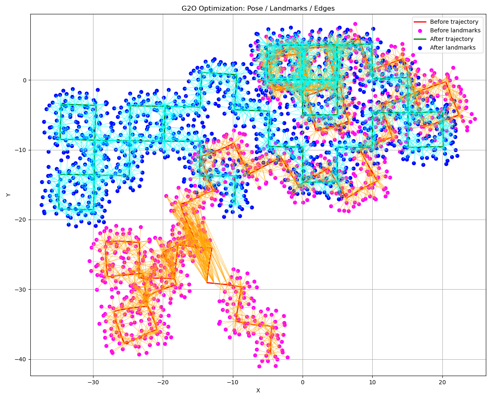

### g2o_viewer 默认不安装 安装参考如下网址
https://blog.csdn.net/fb_941219/article/details/107728123
查看优化的类型
```sh
 bin/g2o_viewer -renameTypes TUTORIAL_VERTEX_SE2=VERTEX_SE2,TUTORIAL_VERTEX_POINT_XY=VERTEX_XY,TUTORIAL_PARAMS_SE2_OFFSET=PARAMS_SE2OFFSET,TUTORIAL_EDGE_SE2=EDGE_SE2,TUTORIAL_EDGE_SE2_POINT_XY=EDGE_SE2_XY tutorial_after.g2o
 ```
综合对比

优化前

优化后


##  一句话总结

> 在图优化中，**误差（残差）** 是：
> **“当前估计的相对位姿” 与 “传感器观测到的相对位姿” 的差距**

---

##  应用背景（图优化中的边）

假设你有两个位姿：

* $\mathbf{T}_i$：顶点 v1 的位姿（例如机器人在时间 t 的位置）
* $\mathbf{T}_j$：顶点 v2 的位姿（时间 t+1 的位置）

以及一个观测值（边）：

* $\mathbf{Z}_{ij}$：你通过传感器（比如 odom/LiDAR）测量到的从 i 到 j 的 **相对位姿**

---

##  数学公式（误差计算）

误差 $\mathbf{e}_{ij}$ 的计算如下：

$$
\mathbf{e}_{ij} = \mathrm{Log}\left( \mathbf{Z}_{ij}^{-1} \cdot (\mathbf{T}_i^{-1} \cdot \mathbf{T}_j) \right)
$$

解释：

* $\mathbf{T}_i^{-1} \cdot \mathbf{T}_j$：当前估计的从 i 到 j 的相对位姿
* $\mathbf{Z}_{ij}^{-1}$：观测值的逆（把观测转到误差空间）
* $\mathrm{Log}(\cdot)$：将位姿变换从 Lie 群转成向量形式（即 `[dx, dy, dθ]`）

---

##  直观解释


* 图中每个节点是机器人的某个时刻的位姿
* 每条边是你从传感器得来的“你应该从 A 走到 B”
* 如果你现在估计的位置与观测值不一致，就有误差

图优化的目的：

> 最小化所有边的误差平方和：
>
> $$
> \min \sum_{i,j} \mathbf{e}_{ij}^T \Omega_{ij} \mathbf{e}_{ij}
> $$

其中 $\Omega_{ij}$ 是信息矩阵（权重）。

---

##  对应到代码

```cpp
SE2 delta = _inverseMeasurement * (v1->estimate().inverse() * v2->estimate());
_error = delta.toVector();
```

对应数学表达式：

* `_inverseMeasurement` = $\mathbf{Z}_{ij}^{-1}$
* `v1->estimate().inverse() * v2->estimate()` = $\mathbf{T}_i^{-1} \cdot \mathbf{T}_j$
* `delta.toVector()` ≈ $\mathrm{Log}(...)$

---

##  bb 误差是怎么影响优化的？

优化器（如 Levenberg–Marquardt）迭代地更新顶点估计，使得所有误差项变得尽可能接近 0，即：

> “所有实际运动” ≈ “观测的运动”

这样优化后的轨迹才更符合传感器数据、更加平滑和一致。

---

##  总结：误差计算的原理是？

| 概念                  | 含义                                                           |
| ------------------- | ------------------------------------------------------------ |
| 误差定义                | 当前估计的相对变换 和 观测到的相对变换 之间的差异                                   |
| 数学表达                | $\mathbf{e} = \mathrm{Log}(Z^{-1} \cdot T_i^{-1} \cdot T_j)$ |
| 图优化的目标              | 最小化所有误差的加权平方和                                                |
| `computeError()` 作用 | 在当前顶点状态下，计算每一条边的误差向量，供优化器使用                                  |

这就是 `computeError()` 背后的 **数学与优化原理**。如果你还想了解 `Jacobian` 是如何计算的，我也可以进一步解释。


这是 SLAM / 机器人学中的核心知识，下面我系统地为你讲解这个式子：

---

## 🔢 你问的式子是：

$$
\mathbf{T}_{ij} = \mathbf{T}_i^{-1} \cdot \mathbf{T}_j
$$

它的意义是：

> **从 i 到 j 的相对位姿（T\_ij）**，可以通过 **用 i 的位姿的逆，左乘 j 的位姿** 来计算。

---

## 🧠 为什么这样算？

先理解：

* $\mathbf{T}_{i}$：世界坐标系下的帧 i 的位姿（$\text{world} \to\ {i} $ ）
* $\mathbf{T}_{j}$：世界坐标系下的帧 j 的位姿（$\text{world} \to\ {j}$）

你要的是：

* $\mathbf{T}_{ij}$：**从帧 i 到帧 j 的变换**（$\text{i} \to\ {j}$）

---

### 📐 推导原理（从坐标变换角度）

我们从变换角度解释：

* 假设某点 $\mathbf{p}$ 在帧 j 中的坐标是 $\mathbf{p}_{j}$
* 那它在世界坐标系中是：$\mathbf{p}_{w}$ = $\mathbf{T}_{j}$ $\cdot \mathbf{p}_{j}$
* 同样，这个点在帧 i 中的坐标是：$\mathbf{p}_{i}$ = $\mathbf{T}_{i}^{-1}$ $\cdot \mathbf{p}_{w}$

代入上式：

$$
\mathbf{p}_i = \mathbf{T}_i^{-1} \cdot \mathbf{T}_j \cdot \mathbf{p}_j
\Rightarrow \mathbf{p}_i = \underbrace{\mathbf{T}_i^{-1} \cdot \mathbf{T}_j}_{\mathbf{T}_{ij}} \cdot \mathbf{p}_j
$$

所以我们得到：

$$
\mathbf{T}_{ij} = \mathbf{T}_i^{-1} \cdot \mathbf{T}_j
$$

即：**从帧 j 到帧 i 的变换矩阵是 $\mathbf{T}_{ij}$。**

---

## 📌 举个二维例子（SE2）

二维情况下，$\mathbf{T}$ 是一个 3×3 的变换矩阵：

$$
\mathbf{T}_i =
\begin{bmatrix}
R_i & t_i \\
0 & 1
\end{bmatrix}
,\quad
\mathbf{T}_j =
\begin{bmatrix}
R_j & t_j \\
0 & 1
\end{bmatrix}
$$

那么它们的相对变换是：

$$
\mathbf{T}_{ij} = \mathbf{T}_i^{-1} \cdot \mathbf{T}_j
$$

这个乘法会给出：

* 相对的旋转 $\theta\_{ij}$
* 相对的平移 $\mathbf{t}\_{ij}$

---

## 🛠 在代码中是怎么做的？

以 G2O 的 `SE2` 为例：

```cpp
SE2 Tij = Ti.inverse() * Tj;
```

* `Ti` 是节点 i 的位姿
* `Tj` 是节点 j 的位姿
* `Ti.inverse()` 表示从 i 坐标系 → 世界
* 所以 `Ti.inverse() * Tj` 表示从 i 坐标系 → j 坐标系的变换

---

## ✅ 总结一句话

> **“从 i 到 j 的相对位姿” 就是 “用 i 的世界位姿的逆，左乘 j 的世界位姿”。**

即：

$$
\boxed{\mathbf{T}_{ij} = \mathbf{T}_i^{-1} \cdot \mathbf{T}_j}
$$

这个公式广泛用于：

* 图优化的误差计算
* ICP 匹配残差
* 机器人运动增量计算

---

非常好，这个问题就是图优化误差项构造的**核心逻辑本质**。

---

##  为什么误差是：

$$
\boxed{
\mathbf{e}_{ij} = \log\left( \underbrace{\mathbf{Z}_{ij}^{-1} \cdot (\mathbf{T}_i^{-1} \cdot \mathbf{T}_j)}_{\text{估计 - 测量的“差”}} \right)
}
$$

或者说：

$$
\text{误差} = \text{测量值}^{-1} \cdot \text{估计值}
$$

我们从直观到严谨，一步步解释。

---

## 1️⃣ 从欧几里得空间说起（你最熟悉的）

在普通 $\mathbb{R}^n$ 空间中：

$$
e = x^{\text{est}} - x^{\text{meas}}
$$

> 比如你测量 $x=3$，估计 $x=5$，误差就是 $5 - 3 = 2$

这是因为欧几里得空间有加减法。

---

## 2️⃣ 位姿不是普通向量！它是李群（SE(2)/SE(3)）

位姿 $\mathbf{T}$（即平移+旋转）是一个 **变换矩阵**，属于 $SE(2)$ 或 $SE(3)$，它是一个**群结构**：

* 没有“直接的减法”
* 但可以用“变换之间的组合”（矩阵乘法）表示它们之间的差异！

---

## 3️⃣ 位姿之间的差异用“相对变换”表示

我们希望表达：

> 从节点 i 走到节点 j 的实际变换是 $\mathbf{Z}_{ij}$（传感器测量）
> 而我当前估计的是 $\mathbf{T}_i^{-1} \cdot \mathbf{T}{_j}$

---

## 🧠 关键点：我们想问的是：

> 我估计的从 i 到 j 的变换，和测量到的变换，**差了多少？**

我们不能用减法，只能问：

> “从测量变换 $\mathbf{Z}_{ij}$ 出发，要变成我估计的变换 $\mathbf{T}_i^{-1} \cdot \mathbf{T}_j$，需要再做什么变换？”

这个“变换差异”就是：

$$
\mathbf{E} = \mathbf{Z}_{ij}^{-1} \cdot (\mathbf{T}_i^{-1} \cdot \mathbf{T}_j)
$$

它是：

* 从测量出发 → 乘一个变换 → 到达估计值

你也可以理解为：

$$
\boxed{
\text{误差} = \text{估计} \div \text{测量} = \text{测量}^{-1} \cdot \text{估计}
}
$$

这就是我们为什么这么构造残差。

---

## 4️⃣ 为什么还要加一个 `log`？

因为这个误差 $\mathbf{E}$ 是一个 $SE(2)$ 的变换矩阵，不能直接优化（它不是一个向量）！

所以我们：

* 用对数映射 $\log$（或 Sophus 中的 `SE2::log()`）将其转为 $\mathbb{R}^3$ 向量

即：

$$
\boxed{
\mathbf{e}_{ij} = \log\left( \mathbf{Z}_{ij}^{-1} \cdot (\mathbf{T}_i^{-1} \cdot \mathbf{T}_j) \right)
}
\Rightarrow
\text{一个 3 维向量残差：}[dx, dy, d\theta]
$$

---

## ✅ 总结一句话：

> 在李群（变换矩阵）上，“估计值与测量值的差异”必须用：
>
> $$
> \text{误差变换} = \text{测量}^{-1} \cdot \text{估计}
> $$
>
> 这是李群上的“右乘误差”定义（Right-invariant error）

然后加上 $\log$，就变成李代数向量，可用于优化。

---
